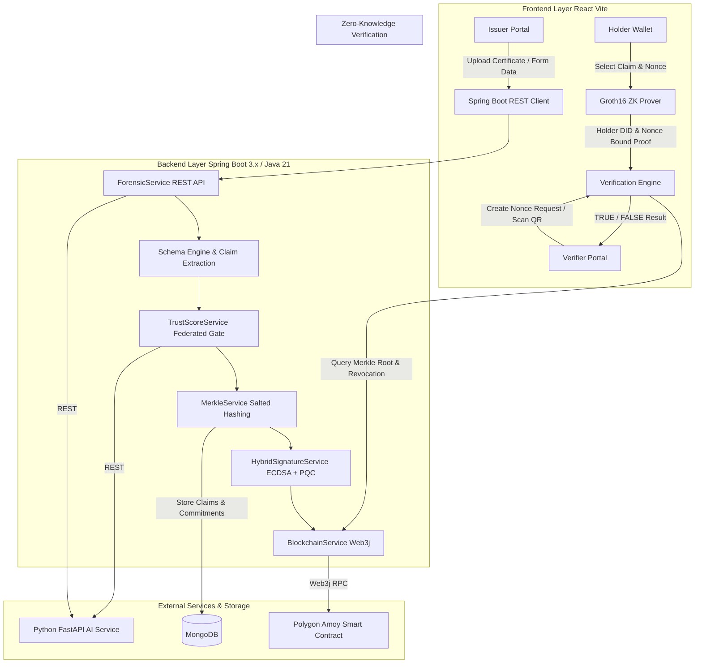

# TrustVerse — Master Platform Guide

> **TrustVerse** is a privacy-preserving, multi-domain credential issuing and zero-knowledge verification platform anchored to **Polygon Amoy Testnet**. It provides a common trust rail where authorized organizations (universities, employers, healthcare, government) issue digitally verifiable credentials without forcing holders to reveal raw certificates during verification.

---

## Architecture & Data Flow Diagram



---

## Core Security Principles

1. **NO RAW DOCUMENT ON BLOCKCHAIN**: Uploaded certificates are analyzed by the Python AI forensic service and discarded immediately after claim extraction. Only salted Merkle roots are anchored.
2. **NO UNSALTED CREDENTIAL HASH**: Every claim is salted with a cryptographically secure 256-bit salt to eliminate dictionary and rainbow table attacks.
3. **NO REUSABLE VERIFICATION PROOF**: Proofs are bound to the holder's DID and a cryptographically secure verifier one-time nonce, rendering stolen proofs useless.
4. **NO UNNECESSARY CREDENTIAL DISCLOSURE**: Verifiers receive only the requested boolean evaluation (e.g. `CGPA >= 7.5 = TRUE`).

---

## Technology Stack

- **Backend**: Java 21, Spring Boot 3.3.2, Spring Data MongoDB, Spring Security (Stateless JWT), Web3j 4.10.3, BouncyCastle PQC.
- **Frontend**: React.js 18, Vite 5, Tailwind CSS 3, Lucide Icons, Ethers.js 6, QRCode.react.
- **Database**: MongoDB 7+.
- **Blockchain**: Solidity 0.8.20, Polygon Amoy Testnet (Chain ID 80002), Hardhat.
- **AI Service**: Python 3.10+, FastAPI, Noise-Print ELA Forgery Analyzer & GAT Federated Fraud Gate simulation.

---

## Repository Structure

```text
trustverse/
├── frontend/                   # React.js + Vite + Tailwind CSS Frontend
├── backend/                    # Java 21 + Spring Boot 3.x Backend Service
├── ai-service/                 # Python FastAPI Forensic & Federated Fraud Service
├── blockchain/                 # Hardhat Smart Contract Development Environment
├── docs/                       # Architecture diagrams & Security documentation
├── docker-compose.yml          # Containerized deployment configuration
└── README.md                   # Master Documentation
```

---

## Quick Start Guide

### 1. Start MongoDB
Ensure MongoDB is running locally on `mongodb://127.0.0.1:27017/trustverse` or via Docker:
```bash
docker run -d -p 27017:27017 --name trustverse-mongo mongo:latest
```

### 2. Start Python FastAPI AI Service
```bash
cd ai-service
pip install -r requirements.txt
python main.py
```
*API runs at `http://127.0.0.1:8000`.*

### 3. Deploy Smart Contract to Polygon Amoy
```bash
cd blockchain
npm install
npx hardhat run scripts/deploy.js --network amoy
```
*Output address should be updated in `backend/src/main/resources/application.properties` under `blockchain.contract-address`.*

### 4. Start Java 21 Spring Boot Backend
```bash
cd backend
mvn spring-boot:run
```
*Backend API runs at `http://localhost:5000`.*

### 5. Start React Vite Frontend
```bash
cd frontend
npm install
npm run dev
```
*Application opens at `http://localhost:5173`.*

---

## End-to-End Demonstration Scenario

1. **Step 1 — Issuer Issuance**:
   - Open `http://localhost:5173/issuer/issue`.
   - Select **Education Schema**.
   - Upload sample certificate `riya_sharma_degree_certificate.pdf`.
   - Click **Run AI Forensic Analysis** (`Score: 0.94 - PASS`).
   - Review extracted claims (`CGPA: 8.7`, `Institution: PCCOER`).
   - Pass Federated Trust Gate (`APPROVED - 0.91 Trust Score`).
   - Click **Execute Salted Commitment & Anchor on Polygon Amoy**.
   - Credential becomes `✓ POLYGON AMOY ANCHORED` with Merkle Root `0x4f82a9...`.

2. **Step 2 — Holder Wallet**:
   - Open `http://localhost:5173/holder/dashboard`.
   - View credential in wallet.
   - Click **Generate Selective Proof**.
   - Select claim **CGPA &ge; 7.5**.
   - Obtain one-time verifier nonce and generate Groth16 ZK proof.

3. **Step 3 — Verifier Portal & Security Audits**:
   - Open `http://localhost:5173/verifier`.
   - Scan QR code or paste session link.
   - Click **Verify Proof**.
   - Display shows: **`✓ CLAIM VERIFIED — TRUE`** (`CGPA >= 7.5`).
   - Click **Simulate Replay Attack Test** to observe automated rejection when an attacker attempts to reuse the proof for another session!

---

## Status of Implemented Features

- [x] Java 21 Spring Boot REST API & MongoDB Spring Data Persistence
- [x] Spring Security JWT Authentication & RBAC
- [x] Multi-Domain Schema Engine (Education, Employment, Healthcare, Government)
- [x] Cryptographic Salted Hashing (`Hash(claim || salt)`)
- [x] Merkle Tree Construction & Merkle Root Verification
- [x] Web3j Polygon Amoy Smart Contract Integration (`TrustVerseAnchor.sol`)
- [x] One-Click On-Chain Revocation Management
- [x] Python FastAPI AI Forensic Service & Federated Fraud Gate Simulation
- [x] Holder Self-Sovereign DID Wallet
- [x] Groth16 Nonce & Holder DID Bound Zero-Knowledge Proof Engine
- [x] Live Security Attack Demonstrations (Dictionary & Replay Defenses)
# trustverse
